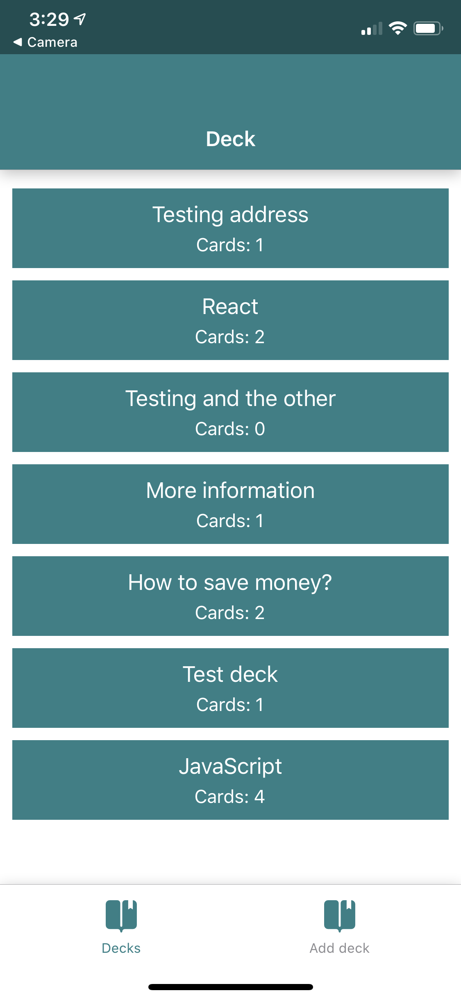
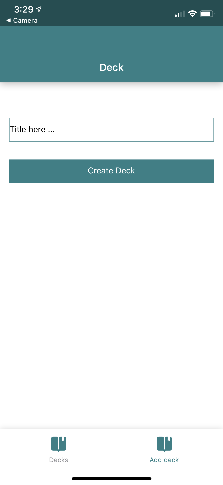
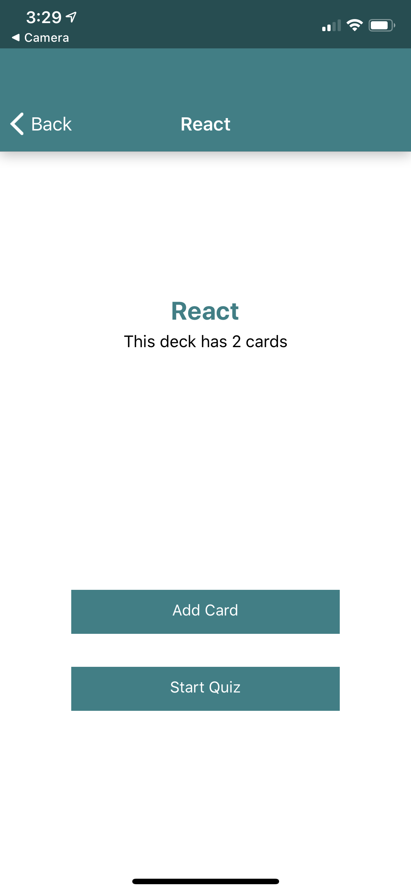
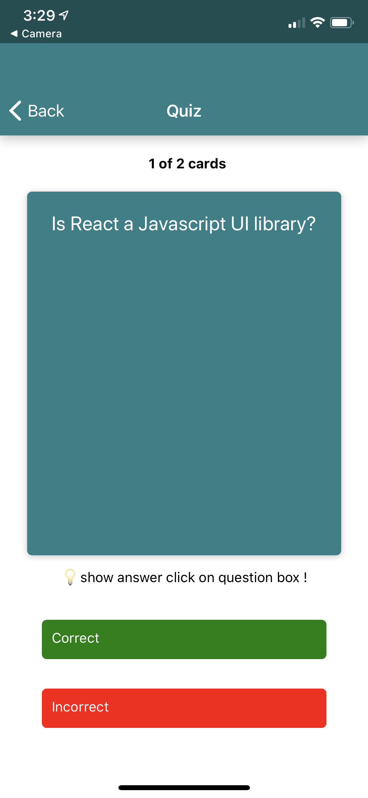
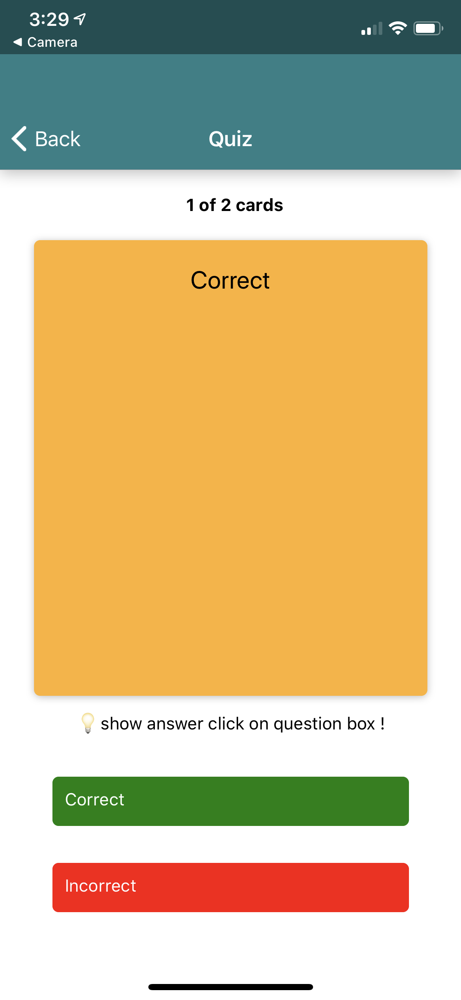
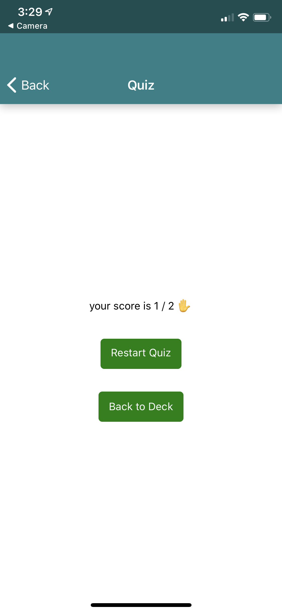

# Mobile Flashcards `(IOS)`

For the UdaciCards project, a mobile application `(iOS)` that allows users to study collections of flashcards. The app will allow users to create different categories of flashcards called "decks", add flashcards to those decks, then take quizzes on those decks.

## Screen

<table>
  <tr>
    <td></td>
    <td></td>
    <td></td>
    <td></td>
  <tr>
  <tr>
    <td></td>
    <td></td>
    <td></td>
  <tr>
</table>

## Install

To get started developing right away:
* Clone
* Run npm install in the terminal  `npm install`
* in the terminal run `npm start`
* install all project dependencies with `npm install --save`

## platform :
- IOS

## Directory Structure
```bash
├── README.md - This file.
├── node_modules # npm package modules file. 
└── src
    ├── components   # All Components of this app
    ├── actions  # Action of redux
    ├── reducers  # reducer of redux
    ├── utils # contain color , helper and api .js
    ├── App.js 
```


## Finctions

## `api.js`
  The provided file [`api.js`](src/utils/api.js) contains the methods you will need to perform necessary operations on the backend:

* [`getInitialData`](#getInitialData)
* [`getDeckByTitle`](#getDeckByTitle)
* [`saveDeckTitle`](#saveDeckTitle)
* [`saveCardToDeck`](#saveCardToDeck)
* 
##### `getInitialData`

Method Signature:

```js
getInitialData()
```

* Returns a JSON object containing a decks and questions objects.

##### `getDeckByTitle`

Method Signature:

```js
getDeckByTitle(title)
```

* title: `<string>` string

##### `saveDeckTitle`

Method Signature:

```js
saveDeckTitle(title)
```
* title: `<string>` string

##### `saveCardToDeck`

Method Signature:

```js
saveCardToDeck(title,card)
```
* title: `<string>` string
* card: `<object>` return an object of card


## `helpers.js`
  The provided file [`helpers.js`](src/utils/helpers.js) contains notifications functions:
  
##### `clearLocalNotification`
##### `createNotification`
##### `setLocalNotification`


## Technologies Used :
- Nodejs 
- yarn
- `create-react-native-app`
- expo
- react-navigation
- Redux `redux`
- React Redux `react-redux`
- react-native-card-flip


